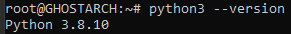
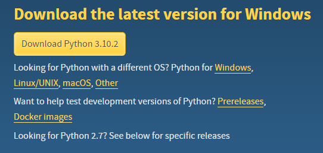
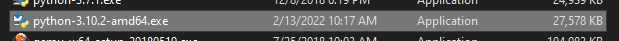
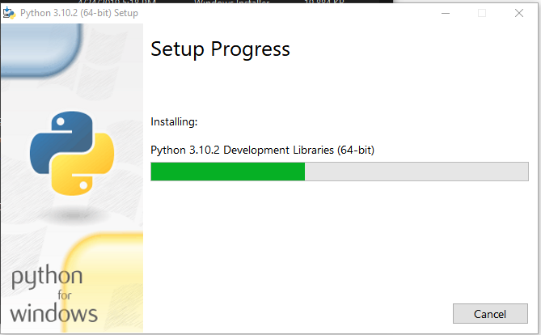
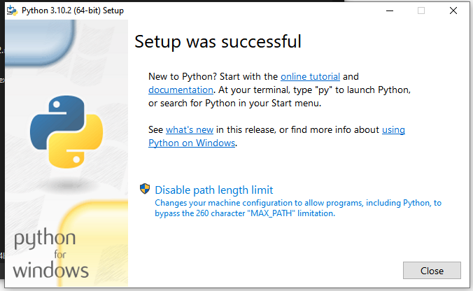
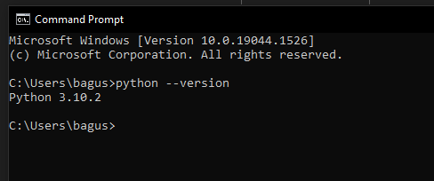

# Instalasi dan Penggunaan _Interpreter_ Python
> Pertemuan Minggu 1

## Sekilas tentang Python

Python adalah _interpreter_ bahasa pemrograman tingkat tinggi.

Mudah untuk digunakan, Bahasa pemrograman script, _fungsional_, Berorientasi Objek, serta dapat membantu programmer dalam proyek dengan skala kecil hingga besar.

Pembuatan aplikasi Desktop GUI, Website, Otomatisasi, Pengembang Game, Seorang _Data Analytics_, _Machine Learning_, AI, dan masih banyak lagi contoh kasus yang menggunakan Python sebagai solusi dari masalah tersebut.

Dalam pertemuan ini akan dibahaskan tentang tahap pertama diantaranya adalah installasi dan beberapa contoh dari penggunaan dari _interpreter_ Python.

## Installasi Python

Dalam hal ini, Proses installasi dapat menggunakan dua cara yaitu dengan _package manager_ (Pada Ubuntu) atau mendownload installer (Windows 10) langsung dari [Website Resmi](https://www.python.org/).

Berikut adalah langkah-langkah installasi dengan package manager:

1. Buka terminal ubuntu dan ketikan perintah berikut untuk merefresh dan update list repository

```bash
sudo apt update
```

2. Menginstall pustaka pendukung

```bash
sudo apt install software-properties-common
```

3. Menambahkan pustaka personal, akan terdapat konfirmasi untuk menambahkan pustaka, tekan `[y]` dan tekan enter

```bash
sudo add-apt-repository ppa:deadsnakes/ppa
```

4. Merefresh dan update list repository kembali dengan tambahan pustaka personal

```bash
sudo apt update
```

5. Menginstal pustaka python versi 3.10 dengan perintah berikut

```bash
sudo apt install python3.10
```

> Versi python dapat di sesuaikan dengan versi yang lebih terbaru

6. Mengecek versi python yang telah berhasil terinstall

```bash
python3.10 --version
```
output yang ditampilkan adalah sebagai berikut



Berikut adalah langkah-langkah installasi dengan installer:

1. Pertama-tama mendownload installer python untuk os windows, dapat dilihat [disini](https://www.python.org/downloads/).



> Saat tulisan ini dibuat versi python adalah 3.10, mungkin saja pada kasus anda versi python bisa lebih tinggi.

2. Dobel klik pada berkas yang telah di download



3. Dalam proses ini anda dapat memilih langsung menginstall python pada lokasi folder yang telah di tentukan dengan mengklik __Install Now__ atau klik __Cutomize installation__ untuk menentukan sendiri path dan paket installasi, Jangan lupa untuk menyentang _Add Python to PATH_.

> Klik __Install Now__ jika tidak mengerti dengan menentukan path dan paket installasi.


4. Tunggu sampai proses installasi selesai



5. Proses installasi berhasil, jika tampil seperti gambar berikut.



6. Untuk dapat mengecek versi python yang telah berhasil terinstall dapat menggunakan perintah berikut pada cmd

```bash
python --version
```

Maka akan menampilkan output berikut



## Penggunaan _Interpreter_ Python

#TODO