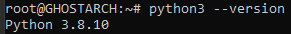
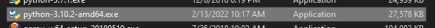
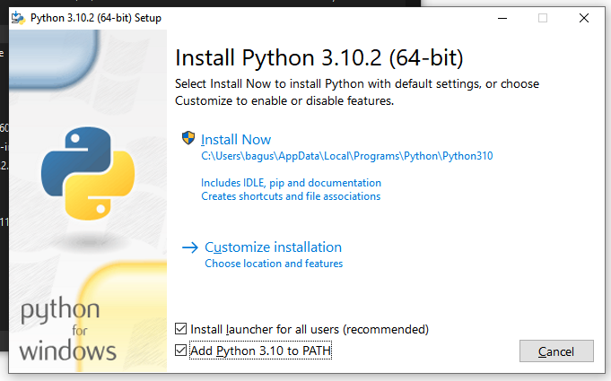
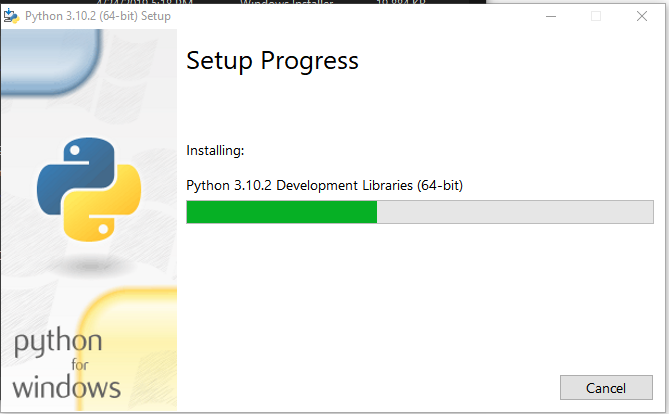
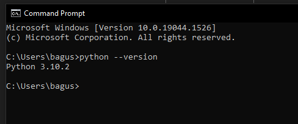

# Instalasi dan Penggunaan _Interpreter_ Python
> Pertemuan Minggu 1

## Sekilas tentang Python

Python adalah _interpreter_ bahasa pemrograman tingkat tinggi.

Mudah untuk digunakan, Bahasa pemrograman script, _fungsional_, Berorientasi Objek, serta dapat membantu programmer dalam proyek dengan skala kecil hingga besar.

Pembuatan aplikasi Desktop GUI, Website, Otomatisasi, Pengembang Game, Seorang _Data Analytics_, _Machine Learning_, AI, dan masih banyak lagi contoh kasus yang menggunakan Python sebagai solusi dari masalah tersebut.

Dalam pertemuan ini akan dibahaskan tentang tahap pertama diantaranya adalah installasi dan beberapa contoh dari penggunaan dari _interpreter_ Python.

## Installasi Python

Dalam hal ini, Proses installasi dapat menggunakan dua cara yaitu dengan _package manager_ (Pada Ubuntu) atau mendownload installer (Windows 10) langsung dari [Website Resmi](https://www.python.org/).

Berikut adalah langkah-langkah installasi dengan package manager:

1. Buka terminal ubuntu dan ketikan perintah berikut untuk merefresh dan update list repository

```bash
$ sudo apt update
```

2. Menginstall pustaka pendukung

```bash
$ sudo apt install software-properties-common
```

3. Menambahkan pustaka personal, akan terdapat konfirmasi untuk menambahkan pustaka, tekan `[y]` dan tekan enter

```bash
$ sudo add-apt-repository ppa:deadsnakes/ppa
```

4. Merefresh dan update list repository kembali dengan tambahan pustaka personal

```bash
$ sudo apt update
```

5. Menginstal pustaka python versi 3.10 dengan perintah berikut

```bash
$ sudo apt install python3.10
```

> Versi python dapat di sesuaikan dengan versi yang lebih terbaru

6. Mengecek versi python yang telah berhasil terinstall

```bash
$ python3.10 --version
```
output yang ditampilkan adalah sebagai berikut



Berikut adalah langkah-langkah installasi dengan installer:

1. Pertama-tama mendownload installer python untuk os windows, dapat dilihat [disini](https://www.python.org/downloads/).


> Saat tulisan ini dibuat versi python adalah 3.10, mungkin saja pada kasus anda versi python bisa lebih tinggi.

2. Dobel klik pada berkas yang telah di download



3. Dalam proses ini anda dapat memilih langsung menginstall python pada lokasi folder yang telah di tentukan dengan mengklik __Install Now__ atau klik __Cutomize installation__ untuk menentukan sendiri path dan paket installasi, Jangan lupa untuk menyentang _Add Python to PATH_.

> Klik __Install Now__ jika tidak mengerti dengan menentukan path dan paket installasi.



4. Tunggu sampai proses installasi selesai



5. Proses installasi berhasil, jika tampil seperti gambar berikut.


6. Untuk dapat mengecek versi python yang telah berhasil terinstall dapat menggunakan perintah berikut pada cmd

```cmd
> python --version
```

Maka akan menampilkan output berikut



## Penggunaan _Interpreter_ Python

Umumnya terdapat cara dalam penggunaan interpreter Python, yaitu dengan memasukkan kode dalam interactive python, atau mengunakan script sebagai parameter pada command `python`.

Jika telah melakukan installasi diatas maka secara default anda dapat menjalankan interactive python dengan perintah berikut,

Pada Ubuntu:
```bash
$ python3.10
```

Pada Windows:
```cmd
> python
```

> Tekan Ctrl + D atau ketik perintah `exit()` untuk dapat keluar dari interactive mode.

Atau menggunakan script yang pada parameter command python sehingga dapat berupa sebagai berikut,

Pada Ubuntu:
```bash
$ python3.10 ./src/script.py
```

Pada Windows:
```cmd
> python src/script.py
```

Kedua perintah diatas akan menampilkan output "Hello World"

## Sintak umum Python

Mencoba beberapa perintah simpel. Jalankan python secara interactive python sehingga dapat memasukan perintah-perintah dibawah.

```python
>>> # cara penulisan komentar pertama
>>> spam = 1  # lalu komentar kedua
>>>           # ... dan lanjut komentar ke tiga
>>> text = "# Ini bukanlah komentar karena berada dalam petik."
```

### Penggunaan Tipe Angka

Berikut beberapa sintak umum dalam penggunaan angka pada python

```python
>>> 2 + 2
4
>>> 50 - 5 * 6
20
>>> (50 - 5 * 6) / 4
5.0
>>> 8 / 5  # pembagian selalu mengembalikan nilai float (pecahan)
1.6
>>>
>>> 17 / 3  # contoh lain pembagian pecahan klasik
5.666666666666667
>>>
>>> 17 // 3  # floor division
5
>>> 17 % 3  # modulus atau sisa bagi 
2
>>> 5 * 3 + 2  # hasil bagi floor division * pembagi + sisa bagi
17
```

### Penggunaan Tipe String

Berikut beberapa sintak umum dalam penggunaan string pada python.

```python
>>> 'Halo Dunia'  # petik satu
'Halo Dunia'

>>> 'KHR. As\'ad Syamsul Arifint'  # menggunakan \' untuk menuliskan pada petik satu string 
"KHR. As'ad Syamsul Arifin"

>>> "KHR. As'ad Syamsul Arifin"  # ...atau menggunakan petik dua
"KHR. As'ad Syamsul Arifin"

>>> '"Hooh," Ucapnya.'
'"Hooh," Ucapnya.'

>>> "\"Hooh,\" Ucapnya."
'"Hooh," Ucapnya.'

>>> '"Isn\'t," Ucapnya.'

'"Isn\'t," Ucapnya.'
```

> Tidak ada perbedaan output pada penulisan dengan petik satu (') atau dobel (")

### Penggunaan Lists

Jika sudah pernah menggunakan bahasa pemrograman mungkin sudah pernah mengetahui tentang Array, jika belum Array (dipython dikenal sebaagai List) adalah bentuk data yang akan menyimpan beberapa nilai atau data sekaligus.

Sebagai contoh:

```python
>>> squares = [1, 4, 9, 16, 25]
>>> squares
[1, 4, 9, 16, 25]
>>>
>>> squares[0]  # mengambil daata pada index 0
1
>>> squares[-1]
25
>>> squares[-3:]  # pemotongan list menampilkan list
[9, 16, 25]
```

## Permulaan Coding

```python

>>> # Fibonacci:
... # penjumlahan angka didefinisikan berikutnya
... a, b = 0, 1
>>> while a < 10:
...     print(a)
...     a, b = b, a+b
0
1
1
2
3
5
8
```

- Pada baris pertama terdapat _multiple assignment_ yaitu pendefinian variabel secaara multiple
- Pada baris kedua adalah perulangan _while_ dengan kondisi `a < 10`
- Pada baris ketiga yaitu menampilkan output variabel `a`
- Terakhir adalah seperti pada baris pertama yaitu _multiple assignment_ dan penjumlahan `a+b`